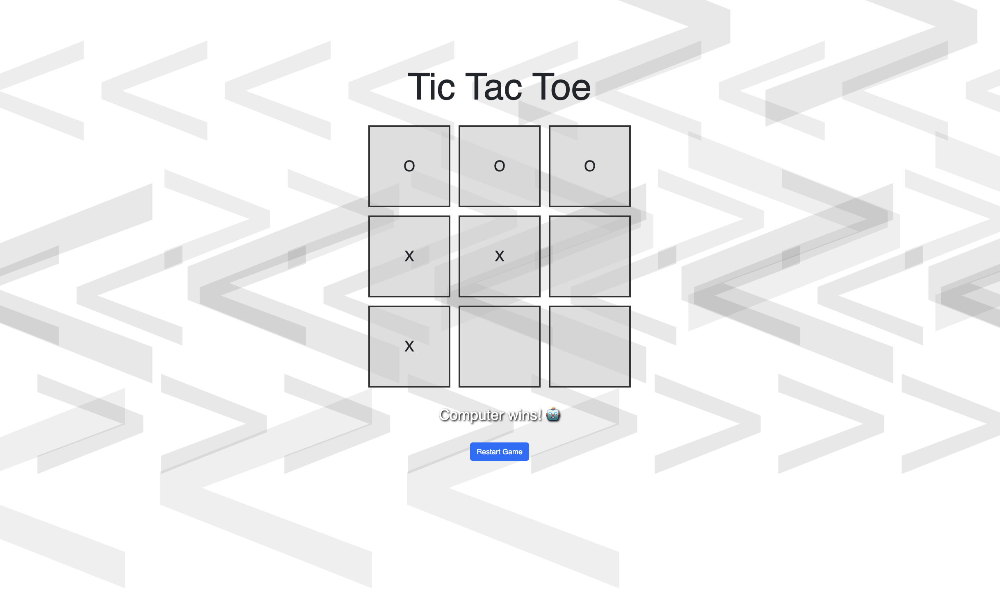
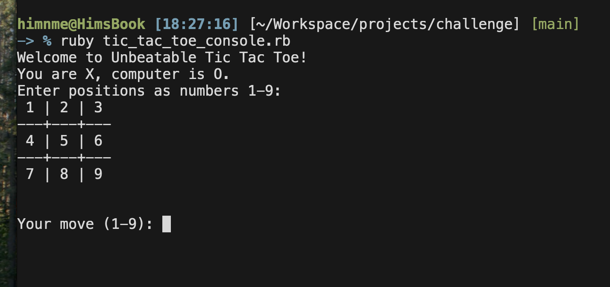

# 🎮 Tic Tac Toe — Unbeatable AI (Ruby / Sinatra)

Welcome to the classic game of Tic Tac Toe — powered by Ruby and enhanced with an unbeatable AI opponent using the Minimax algorithm. This implementation includes:

- ✅ A modern HTML user interface
- ✅ A lightweight Sinatra backend in Ruby
- ✅ An AI that never loses — seriously!
- ✅ Smooth user experience with responsive design & interaction handling
- ✅ Easy setup with Bundler & Gemfile
- ✅ Fast and fun 😉

---

## 🚀 Features

- 🎮 Play Tic Tac Toe directly in your browser!
- 👤 Human goes first, plays as X
- 🧠 AI plays as O using the minimax algorithm — it is guaranteed to play optimally
- 🎨 Beautiful full-screen SVG background (cones.svg)
- ⏳ Simulated AI "thinking time" (2–4 seconds) before every move
- 💡 Visual overlay prevents user input during computer turn
- 🛑 Players can't double-click or play invalid cells
- 🧹 Game board locks after win or draw
- 🧩 Simple game restart button

---

## 🧰 Technology Stack

- Ruby 3.x
- Sinatra (lightweight Ruby web framework)
- HTML5 + CSS + JavaScript (vanilla)
- Bootstrap 5 via CDN (UI styling)
- Browser-based frontend
- No external JavaScript libraries or build tools required

---

## 🗂 Project Structure

```
.
├── app.rb                 # Sinatra backend (routes, game loop)
├── tic_tac_toe.rb         # Unbeatable Tic Tac Toe AI class (Minimax)
├── Gemfile                # Required Ruby gems
└── public/
    ├── index.html         # Frontend UI – single-page HTML
    └── cones.svg          # Background image
```

---

## 🛠 Setup & Installation

Follow the steps below to run the app locally on your machine.

### 1. Clone or Download

Clone this repository or download the source code:

```bash
git clone https://github.com/netuoso/tic-tac-toe.git
cd tic-tac-toe
```

### 2. Install Ruby & Bundler (if not already installed)

Ensure you have Ruby and Bundler:

```bash
ruby -v
gem install bundler
```

### 3. Setup Dependencies

Install required gems using the Gemfile:

📝 Gemfile:

```ruby
# Gemfile
source 'https://rubygems.org'

gem 'sinatra'
```

Then, from the root directory:

```bash
bundle install
```

💡 If not using bundler:

```bash
gem install sinatra
```

### 4. Run the Application

Start the Sinatra server:

```bash
ruby app.rb
```

The server will start on port 4567 by default:

📡 Open http://localhost:4567 in your browser.

You should see the game board ready to play!

---

## 🎮 How to Play

- X = Human (you)
- O = Computer (AI)
- Click on an empty square to make your move
- The board will update, then the computer will "think" for 2–4 seconds and make a move
- The game ends when someone wins or the board fills (draw)
- Press "Restart Game" to play again

⌛️ While the computer is thinking:

- Board interactions are disabled
- An overlay message appears: “Computer is thinking...”

---

## 🧠 AI Behavior

This app uses the minimax algorithm for decision-making:

- The AI (computer) explores all possible move paths and chooses the one that guarantees the best outcome (win or draw)
- Minimax is a recursive search strategy that assumes the opponent plays optimally
- Result: This AI never loses. At best, you draw.

---

## 🧪 Testing

Manual playtesting is included via the browser interface. Recommended behaviors to test:

- Attempt invalid clicks (already occupied cells)
- Try double-clicking rapidly
- Restart after game is over
- Attempt to beat the AI 😏

---

## 💡 Developer Notes

- Full interaction is handled via client-side JavaScript in index.html
- Backend stores current game state in Sinatra sessions
- Public folder serves frontend assets (index.html and cones.svg)
- Responsive UX even without frontend frameworks like React or Vue

---

## 📦 Known Limitations

- Sessions are not persisted across restarts (uses in-memory session hash)
- Only supports one game at a time (instance-based)
- Not deployed — runs only locally

---

## 📬 Submission Notes for Challenge Reviewers

Dear Mr. Martin,

Thank you for reviewing my coding challenge. Some highlights:

- Written completely with clarity and simplicity in mind
- Follows MVC principles even in a small app
- Game isolates logic from UI and routing
- Demonstrates understanding of client-server communication and game state
- User experience is polished despite minimalist stack

Cheers!

---

## 📸 Screenshot



---

## 📦 Console Version

- Also included is a console version (without index.html or Sinatra requirements)
- Run the console version using: `ruby tic_tac_toe_console.rb`
- Follow on-screen directions... moves are made by entering integers 1-9 and pressing Enter/Return

---

## 📸 Screenshot



---

## 📃 License

This project is released under the MIT License.